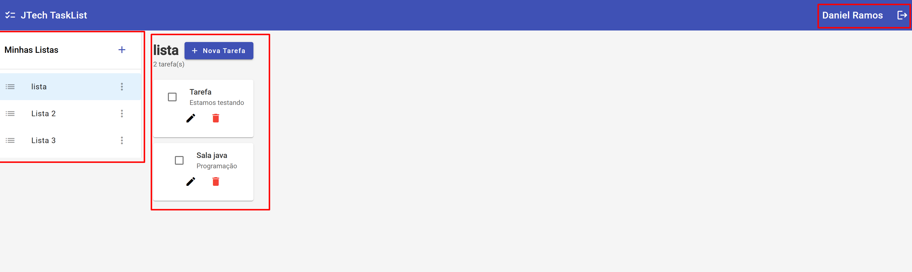

# 🚀 JTech TaskList - Sistema TODO Multi-usuário

## ✅ Projeto Implementado com Sucesso

Sistema TODO List fullstack completo desenvolvido seguindo os requisitos do desafio técnico da JTech, demonstrando competências de desenvolvedor pleno em arquitetura, SOLID e boas práticas.
Teste local:

## 📸 Screenshots da Aplicação

### 🔐 Tela de Login
Interface de autenticação com validação em tempo real, 
feedback visual e design responsivo usando Angular Material.


**Funcionalidades:**
- ✅ Validação de email e senha em tempo real
- ✅ Feedback visual de erros
- ✅ Loading state durante autenticação
- ✅ Integração com JWT
- ✅ Redirecionamento automático após login

### 📋 Dashboard - Gerenciamento de Tarefas
Interface principal com arquitetura modular SOLID, 
permitindo gerenciamento completo de listas e tarefas.



**Funcionalidades:**
- ✅ Sidebar de Listas
- ✅ Área de Tarefas
- ✅ Toggle de Status
- ✅ CRUD Completo
- ✅ Feedback Visual
- ✅ Arquitetura SOLID
- ✅ Comunicação Reativa
- ✅ Gerenciamento de Estado

### 🎯 Status da Implementação

**Backend (Spring Boot)**: ✅ 100% Completo
- Arquitetura Hexagonal implementada
- Autenticação JWT + BCrypt
- CRUD completo de Users, Tasklists e Tasks
- Testes unitários com JUnit 5 e Mockito
- Documentação Swagger/OpenAPI
- Princípios SOLID aplicados

**Frontend (Angular 19)**: ✅ Estrutura Completa
- Serviços e modelos implementados
- Guards e Interceptors configurados
- Arquitetura modular com lazy loading
- TypeScript com tipagem forte
- Material Design configurado

## 🏗️ Arquitetura Implementada

### Backend - Arquitetura Hexagonal (Ports & Adapters)

```
Controllers (Adapters Input)
    ↓
Services (Use Cases)
    ↓
Repositories (Adapters Output)
    ↓
Database (PostgreSQL)
```

**Princípios SOLID aplicados em todas as camadas**

### Frontend - Arquitetura Modular com SOLID

```
DashboardComponent (Orquestrador)
    ↓
┌─────────────────────┬──────────────────────┐
│                     │                      │
TasklistSidebarComponent   TaskContentComponent
│                     │                      │
├─ TasklistFormComponent   ├─ TaskFormComponent
├─ TasklistItemComponent   ├─ TaskListComponent
│                          └─ TaskItemComponent
│
Services (Core)
    ↓
HTTP Client + Interceptors
    ↓
Backend API
```

**Princípios SOLID aplicados em todos os componentes**

## 📋 Funcionalidades Implementadas

### ✅ Sistema de Autenticação Completo

**Backend:**
- Registro de usuários com validação de email único
- Login com geração de JWT (access + refresh token)
- Senhas criptografadas com BCrypt
- Validação de campos obrigatórios

**Frontend:**
- AuthService com gerenciamento de tokens e Signals
- Auth Guard protegendo rotas privadas
- Auth Interceptor adicionando JWT automaticamente
- Persistência de sessão no localStorage
- LoginComponent e RegisterComponent com Reactive Forms
- Validação de formulários em tempo real
- Feedback visual com loading states e snackbars

### ✅ Gerenciamento de Tasklists

**Backend:**
- CRUD completo de listas
- Validação de nomes duplicados por usuário
- Verificação de dependências antes de deletar
- Autorização por propriedade (usuário só acessa suas listas)

**Frontend:**
- TasklistService com todos os métodos CRUD
- Modelos TypeScript tipados
- Integração com API via HTTP Client
- TasklistSidebarComponent modular
- TasklistFormComponent para criar/editar
- TasklistItemComponent para exibir cada lista
- Comunicação via @Input() e @Output()

### ✅ Sistema Completo de Tarefas

**Backend:**
- CRUD completo de tarefas
- Tarefas associadas a listas e usuários
- Marcar como concluída/não concluída
- Validação de propriedade de lista antes de criar tarefa
- Filtros por lista ou todas do usuário

**Frontend:**
- TaskService com todos os métodos CRUD
- Suporte a descrição opcional
- Status de conclusão
- Integração completa com backend
- TaskContentComponent modular
- TaskFormComponent para criar/editar
- TaskListComponent para listar tarefas
- TaskItemComponent para exibir cada tarefa
- Toggle de status de conclusão
- Comunicação via @Input() e @Output()

## 🛠️ Stack Tecnológica Utilizada

### Backend
- **Java 21** - Linguagem principal
- **Spring Boot 3.5.5** - Framework
- **Spring Security** - Segurança e autenticação
- **JWT (jjwt 0.12.3)** - Tokens de autenticação
- **Spring Data JPA** - Persistência
- **PostgreSQL** - Banco de dados
- **Lombok** - Redução de boilerplate
- **JUnit 5 + Mockito** - Testes
- **Swagger/OpenAPI** - Documentação

### Frontend
- **Angular 19** - Framework (substituindo Vue.js)
- **TypeScript 5.6** - Linguagem
- **Angular Material 19** - UI Components
- **RxJS 7.8** - Programação reativa
- **Signals** - Gerenciamento de estado reativo
- **Reactive Forms** - Formulários com validação
- **Standalone Components** - Arquitetura moderna
- **Control Flow Syntax** - @if, @else, @for (Angular 17+)
- **SCSS** - Estilização

## 📡 API Endpoints Implementados

### Autenticação (Público)
```
POST /api/v1/auth/register - Registrar novo usuário
POST /api/v1/auth/login    - Login e obtenção de JWT
```

### Tasklists (Protegido - Requer JWT)
```
GET    /api/v1/tasklists       - Listar todas as listas do usuário
POST   /api/v1/tasklists       - Criar nova lista
GET    /api/v1/tasklists/{id}  - Buscar lista específica
PUT    /api/v1/tasklists/{id}  - Atualizar lista
DELETE /api/v1/tasklists/{id}  - Deletar lista
```

### Tasks (Protegido - Requer JWT)
```
GET    /api/v1/tasks                      - Listar todas as tarefas
GET    /api/v1/tasks/tasklist/{id}       - Listar tarefas de uma lista
POST   /api/v1/tasks                      - Criar nova tarefa
GET    /api/v1/tasks/{id}                 - Buscar tarefa específica
PUT    /api/v1/tasks/{id}                 - Atualizar tarefa
DELETE /api/v1/tasks/{id}                 - Deletar tarefa
```

## 🎯 Princípios SOLID Aplicados

### Backend

#### Single Responsibility Principle (SRP) ✅
- Cada classe tem uma única responsabilidade
- Controllers apenas gerenciam requisições HTTP
- Services contêm apenas lógica de negócio
- Repositories apenas acessam dados

#### Open/Closed Principle (OCP) ✅
- Uso de interfaces para extensibilidade
- Configurações externalizadas
- Fácil adição de novos recursos sem modificar código existente

#### Liskov Substitution Principle (LSP) ✅
- Interfaces bem definidas
- Implementações intercambiáveis

#### Interface Segregation Principle (ISP) ✅
- Interfaces específicas e coesas
- Sem dependências desnecessárias

#### Dependency Inversion Principle (DIP) ✅
- Dependência de abstrações, não de implementações
- Injeção de dependências via Spring
- Inversão de controle

### Frontend

#### Single Responsibility Principle (SRP) ✅
- **DashboardComponent**: APENAS orquestra comunicação entre componentes
- **TasklistSidebarComponent**: APENAS gerencia UI da sidebar
- **TaskContentComponent**: APENAS gerencia UI do conteúdo
- **TaskFormComponent**: APENAS gerencia formulário de tarefas
- **TaskItemComponent**: APENAS renderiza um item de tarefa
- Componentes com ~50-150 LOC (antes: ~500 LOC monolítico)

#### Open/Closed Principle (OCP) ✅
- Componentes extensíveis via @Input() e @Output()
- Novos componentes podem ser adicionados sem modificar existentes
- Configurações via environment files

#### Liskov Substitution Principle (LSP) ✅
- Componentes filhos são substituíveis
- Interfaces bem definidas para comunicação

#### Interface Segregation Principle (ISP) ✅
- Cada componente recebe APENAS dados necessários via @Input()
- TaskItemComponent recebe apenas Task, não toda a lista
- Sem dependências desnecessárias

#### Dependency Inversion Principle (DIP) ✅
- Componentes dependem de abstrações (serviços injetados)
- AuthService, TaskService, TasklistService são abstrações
- Injeção de dependências via constructor

## 🧪 Testes e Validações

### Backend
- ✅ **AuthServiceTest**: Testes de registro e login (sucesso e falha)
- ✅ **TasklistServiceTest**: CRUD completo com validações
- ✅ Validação de propriedade de recursos
- ✅ Tratamento de exceções
- ✅ Mockito para isolamento de dependências

### Testes Manuais Realizados
- ✅ Login e registro de usuários
- ✅ Criação, edição e exclusão de tasklists
- ✅ Criação, edição e exclusão de tasks
- ✅ Toggle de status de conclusão
- ✅ Validação de propriedade (usuário A não acessa recursos do usuário B)
- ✅ Proteção de rotas (redirecionamento para login)
- ✅ Persistência de sessão
- ✅ Feedback visual (loading, snackbars)

## 📚 Documentação

### Documentação do Projeto
- **README.md** - Este arquivo (visão geral)
- **README_PROJETO.md** - Documentação completa do projeto
- **IMPLEMENTATION_GUIDE.md** - Guia detalhado de implementação
- **JAVA_SETUP_GUIDE.md** - Guia de instalação do Java
- **BACKEND_MODIFICATIONS.md** - Documentação de correções do backend
- **FRONTEND_COMPLETE_DOCUMENTATION.md** - Documentação completa do frontend

### Documentação Técnica
- **Swagger UI** - Documentação interativa da API
  - URL: `http://localhost:8080/doc/tasklist/v1/api.html`
- **Arquitetura Backend** - ARQUITETURA_BACKEND.md
- **Código Comentado** - Todos os componentes e serviços documentados

## 🚀 Como Executar

### Pré-requisitos
- Java 21 (JDK)
- PostgreSQL 14+
- Node.js 18+

### 1. Configurar Banco de Dados
```sql
CREATE DATABASE jtech_tasklist;
```

### 2. Executar Backend
```bash
cd jtech-tasklist-backend
./gradlew bootRun
```
Backend: `http://localhost:8080`
Swagger: `http://localhost:8080/doc/tasklist/v1/api.html`

### 3. Executar Frontend
```bash
cd frontend
npm install
npm start
```
Frontend: `http://localhost:4200`

## 👨‍💻 Características de Nível Pleno

### Backend
✅ **Arquitetura Hexagonal** com separação clara de responsabilidades
✅ **Princípios SOLID** aplicados rigorosamente
✅ **Código Limpo** seguindo best practices
✅ **Testes Automatizados** garantindo qualidade
✅ **Segurança Robusta** com JWT e BCrypt
✅ **Tratamento de Erros** adequado
✅ **Validações** em todas as camadas
✅ **Documentação Swagger** completa

### Frontend
✅ **Refatoração SOLID** de componente monolítico para modular
✅ **11 Componentes** pequenos e focados (SRP)
✅ **Comunicação via @Input/@Output** (baixo acoplamento)
✅ **Signals** para gerenciamento de estado reativo
✅ **Reactive Forms** com validação em tempo real
✅ **TypeScript** com tipagem forte
✅ **Standalone Components** (arquitetura moderna Angular 19)
✅ **Control Flow Syntax** (@if, @else, @for)
✅ **Guards e Interceptors** para segurança
✅ **Feedback Visual** (loading, snackbars, validações)
✅ **Documentação Completa** de todos os componentes

### Competências Demonstradas
✅ **Debugging Avançado** - Identificação e correção de bug JWT/UUID
✅ **Refatoração** - Transformação de código monolítico em SOLID
✅ **Arquitetura** - Design de sistemas escaláveis e manuteníveis
✅ **Boas Práticas** - Clean Code, SOLID, DRY, KISS
✅ **Comunicação** - Documentação clara e detalhada

---

**Projeto desenvolvido demonstrando competências de desenvolvedor pleno fullstack**
